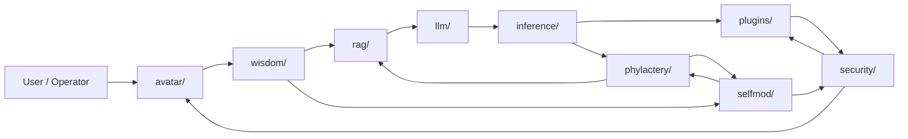
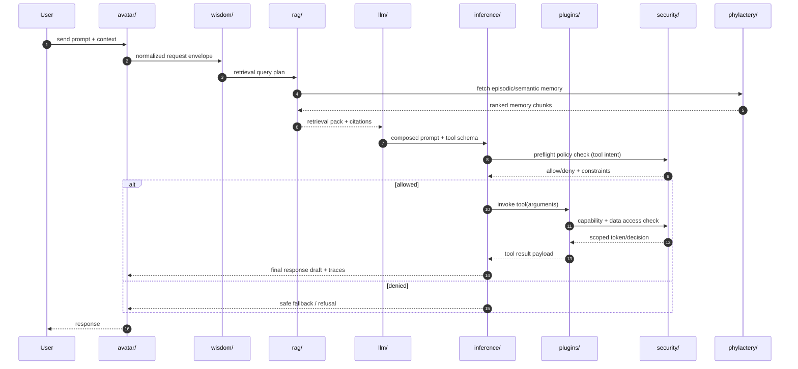
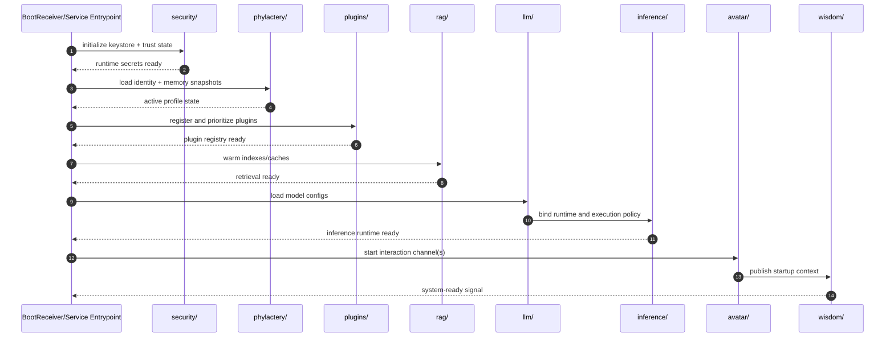
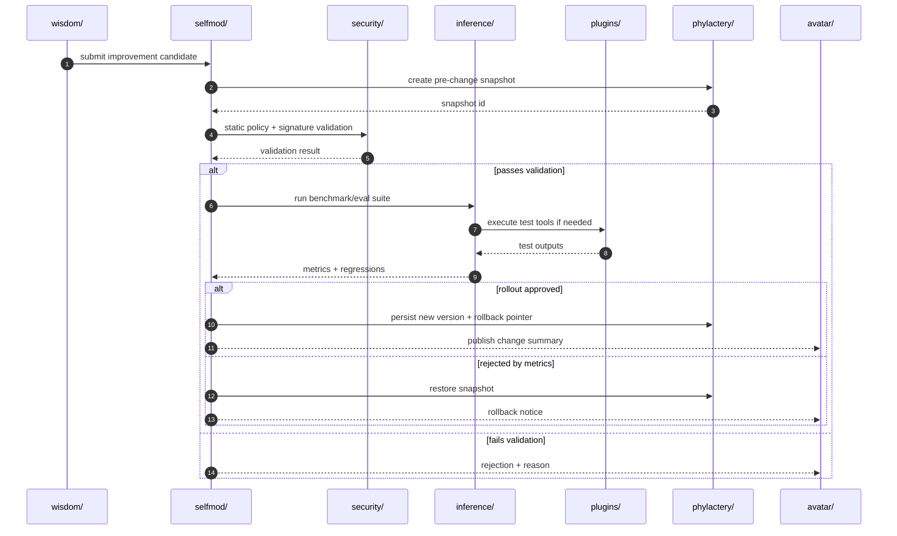

# TronProtocol Architecture Blueprint

This document is the single architecture blueprint for the AI runtime subsystems listed below:

- `inference/`
- `llm/`
- `rag/`
- `plugins/`
- `security/`
- `selfmod/`
- `avatar/`
- `wisdom/`
- `phylactery/`

Use this page to align implementation decisions, interface ownership, failure handling, and observability across all future work.

## 1) System Data Flow (Cross-Subsystem)

### Runtime flow summary
1. `avatar/` receives and normalizes user interaction payloads (text/media/metadata).
2. `wisdom/` performs policy, intent shaping, and response-style planning.
3. `rag/` enriches context by searching local memory/index sources.
4. `llm/` prepares prompts, model/runtime configuration, and token budgets.
5. `inference/` executes model inference and decides whether tool calls are needed.
6. `plugins/` executes tools with `security/` guardrails (authorization, crypto, trust checks).
7. `phylactery/` stores durable memory, identity snapshots, and recovery state.
8. `selfmod/` proposes and evaluates runtime/self-improvement changes under `security/` validation and `phylactery/` rollback guarantees.

## 2) Critical Path Sequence Diagrams

### 2.1 User prompt → retrieval → inference → tool call

### 2.2 Startup/background service initialization

### 2.3 Self-mod proposal → validation → rollout

## 3) Subsystem Contracts

> Each subsystem section defines owner interfaces, inputs/outputs, failure modes, and observability events.

### 3.1 `avatar/`
- **Owner interface(s)**
  - `AvatarGateway`
  - `SessionChannel`
  - `UserInteractionAdapter`
- **Inputs**
  - User prompts, media references, session metadata, UI-origin events.
- **Outputs**
  - Normalized request envelopes to `wisdom/`, user-facing responses, UI status/state events.
- **Failure modes**
  - Malformed user payloads, session state desync, unsupported media type.
- **Observability events**
  - `avatar.request.received`
  - `avatar.request.rejected`
  - `avatar.response.delivered`
  - `avatar.session.state_changed`

### 3.2 `wisdom/`
- **Owner interface(s)**
  - `WisdomOrchestrator`
  - `PolicyReasoner`
  - `ResponseStrategyPlanner`
- **Inputs**
  - Normalized user request, active goals/constraints, prior turn summaries.
- **Outputs**
  - Retrieval plan for `rag/`, generation directives for `llm/`, self-improvement candidates for `selfmod/`.
- **Failure modes**
  - Goal conflict resolution failure, policy ambiguity, over-constrained prompt plan.
- **Observability events**
  - `wisdom.plan.created`
  - `wisdom.policy.violation_detected`
  - `wisdom.selfmod.proposal_emitted`

### 3.3 `rag/`
- **Owner interface(s)**
  - `RetrievalCoordinator`
  - `MemoryIndexer`
  - `ContextAssembler`
- **Inputs**
  - Query plan from `wisdom/`, memory/index state from `phylactery/`.
- **Outputs**
  - Ranked context chunks, citations/provenance metadata, retrieval diagnostics.
- **Failure modes**
  - Empty recall, stale index, retrieval timeout, low-confidence recall.
- **Observability events**
  - `rag.query.started`
  - `rag.query.completed`
  - `rag.retrieval.empty`
  - `rag.index.refresh_required`

### 3.4 `llm/`
- **Owner interface(s)**
  - `PromptComposer`
  - `ModelConfigResolver`
  - `TokenBudgetManager`
- **Inputs**
  - Retrieval pack, system prompt policy, model/runtime constraints.
- **Outputs**
  - Executable inference request package for `inference/`.
- **Failure modes**
  - Token budget overflow, invalid model config, unsupported tool schema serialization.
- **Observability events**
  - `llm.prompt.composed`
  - `llm.prompt.truncated`
  - `llm.config.error`

### 3.5 `inference/`
- **Owner interface(s)**
  - `InferenceEngine`
  - `ToolDecisionRouter`
  - `ResponseSynthesizer`
- **Inputs**
  - LLM execution package, tool schemas, security policy decisions.
- **Outputs**
  - Generated response drafts, tool invocation intents, confidence/latency metrics.
- **Failure modes**
  - Runtime model failure, hallucination threshold breach, tool selection loop.
- **Observability events**
  - `inference.request.started`
  - `inference.request.completed`
  - `inference.tool_call.proposed`
  - `inference.hallucination.guard_triggered`

### 3.6 `plugins/`
- **Owner interface(s)**
  - `PluginRegistry`
  - `PluginExecutor`
  - `CapabilityRouter`
- **Inputs**
  - Tool invocation intents from `inference/`, scoped authorization from `security/`.
- **Outputs**
  - Tool execution results, side-effect audit records, plugin health status.
- **Failure modes**
  - Plugin timeout, malformed arguments, denied capability, third-party API failure.
- **Observability events**
  - `plugins.invoke.started`
  - `plugins.invoke.completed`
  - `plugins.invoke.denied`
  - `plugins.health.degraded`

### 3.7 `security/`
- **Owner interface(s)**
  - `SecurityPolicyEngine`
  - `EncryptionManager`
  - `TrustMonitor`
- **Inputs**
  - Access requests from `plugins/` and `inference/`, key material/runtime trust signals.
- **Outputs**
  - Allow/deny decisions, scoped access tokens, encryption/decryption services, tamper alerts.
- **Failure modes**
  - Keystore unavailable, policy evaluation failure, tamper detection positive, key rotation mismatch.
- **Observability events**
  - `security.policy.check`
  - `security.access.denied`
  - `security.tamper.detected`
  - `security.keystore.error`

### 3.8 `selfmod/`
- **Owner interface(s)**
  - `SelfModificationManager`
  - `ChangeValidator`
  - `RolloutController`
- **Inputs**
  - Improvement proposals from `wisdom/`, policy decisions from `security/`, eval metrics from `inference/`.
- **Outputs**
  - Approved/rejected change decisions, rollout plans, rollback actions.
- **Failure modes**
  - Unsafe patch proposal, validation pipeline failure, regression during canary, rollback failure.
- **Observability events**
  - `selfmod.proposal.received`
  - `selfmod.validation.passed`
  - `selfmod.validation.failed`
  - `selfmod.rollout.completed`
  - `selfmod.rollback.invoked`

### 3.9 `phylactery/`
- **Owner interface(s)**
  - `ContinuityStore`
  - `SnapshotManager`
  - `IdentityStateRepository`
- **Inputs**
  - Memory/state writes from runtime subsystems, snapshot requests from `selfmod/` and boot flow.
- **Outputs**
  - Durable snapshots, memory chunks, version lineage, restore handles.
- **Failure modes**
  - Storage corruption, snapshot write failure, restore conflict, version graph inconsistency.
- **Observability events**
  - `phylactery.snapshot.created`
  - `phylactery.snapshot.restore_started`
  - `phylactery.snapshot.restore_failed`
  - `phylactery.store.integrity_alert`

## 4) Integration Rules for Future Work

1. Any feature PR touching one of these subsystems must update this architecture file if interfaces, data flow, or events change.
2. New observability events should follow the `<subsystem>.<domain>.<action>` naming pattern.
3. `selfmod/` changes must include explicit rollback mapping via `phylactery/` snapshot IDs.
4. `plugins/` side effects must pass through `security/` policy checks before execution.
5. Retrieval and generation changes should preserve provenance from `rag/` through `llm/` into `inference/` traces.
